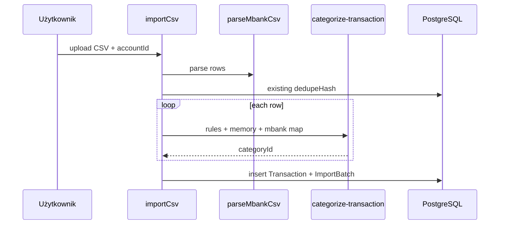

# Architektura

Monolit **Next.js 15** (App Router) + **PostgreSQL** (Prisma). Logika biznesowa w `src/lib/`, mutacje w `src/server/actions/`, UI w `src/app/` i `src/components/`.

---

## Warstwy

```
┌─────────────────────────────────────────────────────────┐
│  Przeglądarka (React 19, Server + Client Components)   │
├─────────────────────────────────────────────────────────┤
│  App Router — src/app/(app)/*, (auth)/*, api/*         │
├─────────────────────────────────────────────────────────┤
│  Server Actions — auth, import, categories, ai,          │
│                   optimization, research, transactions │
├─────────────────────────────────────────────────────────┤
│  src/lib/ — czysta logika (bez importów React)           │
│    analytics/  mbank/  categorization/  optimization/ │
│    ai/  import/  transactions/                         │
├─────────────────────────────────────────────────────────┤
│  Prisma → PostgreSQL                                   │
└─────────────────────────────────────────────────────────┘
```

---

## Autoryzacja

- **NextAuth v5** + adapter Prisma, sesja httpOnly.
- Każdy request aplikacji: `auth()` → `session.user.workspaceId`.
- Server Actions na początku sprawdzają sesję; zapytania Prisma zawsze z `workspaceId` (izolacja tenantów).

---

## Przepływ importu CSV



Kluczowe pliki:

- `src/lib/mbank-csv.ts` — parser
- `src/lib/import/process-csv-import.ts` — deduplikacja, batch insert
- `src/lib/categorization/` — reguły, pamięć kontrahenta
- `src/server/actions/import.ts`

---

## Analytics i dashboard

`loadDashboardData(workspaceId, context, range)` w `src/lib/analytics/load-dashboard.ts`:

1. Pobiera transakcje dla `accountIds` (firma/dom/razem).
2. Dzieli na okres bieżący i poprzedni.
3. Liczy KPI (`period-summary`), slice’y kategorii, top merchantów.
4. Dołącza top 3 `OptimizationOpportunity` (OPEN) i liczbę `BUDGET_OVERRUN`.

Wykresy: **Recharts** w komponentach `src/components/dashboard/`.

---

## Optymalizacja budżetu

Silnik deterministyczny — szczegóły w [optimization.md](optimization.md).

AI uzupełniająco:

- `generateSpendingInsights` — markdown na workspace (kontekst z `accountIdsForContext`)
- `researchOpportunityAlternatives` — Tavily Search + synteza JSON → `OpportunityResearch`

---

## AI — provider

`src/lib/ai/config.ts` wybiera **Anthropic** lub **OpenAI** z `.env` (`AI_PROVIDER` opcjonalnie wymusza).

| Użycie              | Plik                                                   |
| ------------------- | ------------------------------------------------------ |
| Batch kategoryzacja | `run-categorization.ts`, `categorize-batch.ts`         |
| Analiza wydatków    | `generate-insights.ts`                                 |
| Synteza alternatyw  | `research/synthesize-alternatives.ts` (jeśli istnieje) |

Brak klucza API: funkcje AI zwracają komunikat po polsku; mapowanie mBank działa bez API.

---

## Deploy

- **Vercel** — `next build`, serverless functions.
- **Neon** — Postgres; `DATABASE_URL` (pooled), `DIRECT_URL` (migracje).
- Build: `prisma generate` → `prisma migrate deploy` → `next build` (skrypt `vercel-build`).

Patrz: [deploy-vercel-neon.md](deploy-vercel-neon.md).

---

## Jakość i reguły

- ESLint: max 25 linii/funkcja, max 200 linii/plik (wyjątek: schema Prisma).
- Testy: `tests/lib/` lustruje `src/lib/`; `tests/integration/` z DB; `tests/e2e/` Playwright.
- Reguły Cursor: `.cursor/rules/code-readability.mdc`, `testing.mdc`.
