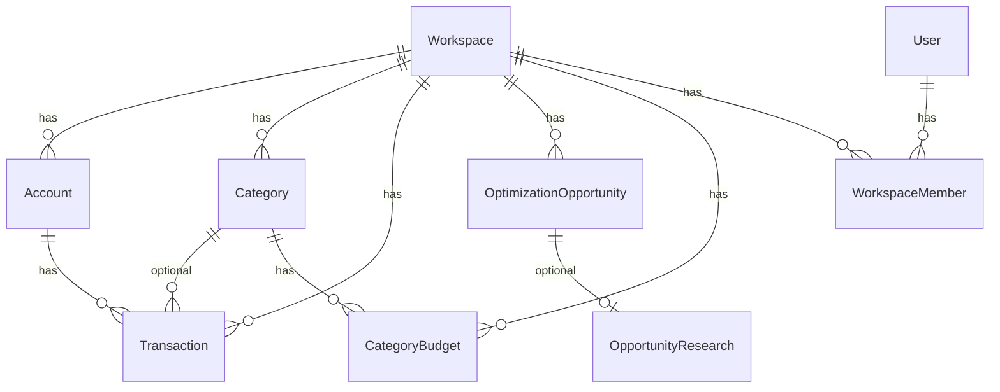

# Model danych

PostgreSQL, ORM **Prisma 6**. Wszystkie dane biznesowe są izolowane per **workspace** (para / gospodarstwo).

---

## Diagram relacji (uproszczony)



---

## Rdzeń

### User

Użytkownik aplikacji (email + hash hasła). Może należeć do wielu workspace przez `WorkspaceMember`.

### Workspace

Wspólna przestrzeń dla pary. Pola cache AI: `lastAiInsight`, `lastAiInsightAt`. `inviteCode` do dołączania drugiej osoby.

### WorkspaceMember

Powiązanie user ↔ workspace, rola domyślnie `member`.

### Account

Konto bankowe w workspace: `type` = `firma` | `dom`, `name` (etykieta UI).

### Transaction

Pojedyncza operacja z wyciągu.

| Pole            | Opis                                        |
| --------------- | ------------------------------------------- |
| `dedupeHash`    | Unikalny w workspace — deduplikacja importu |
| `bookedAt`      | Data księgowania                            |
| `amount`        | Ujemne = wydatek, dodatnie = wpływ          |
| `counterparty`  | Kontrahent z CSV                            |
| `description`   | Opis operacji                               |
| `mbankCategory` | Kategoria z eksportu mBank                  |
| `categoryId`    | Kategoria aplikacji (nullable)              |

Indeksy: `(workspaceId, bookedAt)`, `(workspaceId, categoryId)`.

---

## Kategoryzacja

### Category

Kategoria własna workspace (`name` unikalne w workspace, `color`, `isDefault`).

### CategoryRule

Reguła tekstowa: `matchField` + `matchContains` → `categoryId`, `priority`.

### MerchantCategoryMemory

Po ręcznej korekcie: `counterparty` → `categoryId` (unikalne per workspace).

### ImportBatch

Metadane importu: `fileName`, `newCount`, `skippedCount`, powiązane transakcje.

---

## Optymalizacja budżetu

### OptimizationOpportunity

Wykryta możliwość oszczędności.

| Pole                      | Opis                                                                       |
| ------------------------- | -------------------------------------------------------------------------- |
| `type`                    | `RECURRING`, `SUBSCRIPTION`, `ANOMALY`, `MERCHANT_SPIKE`, `BUDGET_OVERRUN` |
| `status`                  | `OPEN`, `ACKNOWLEDGED`, `IMPLEMENTED`, `DISMISSED`                         |
| `accountContext`          | `firma`, `dom`, `razem`                                                    |
| `estimatedMonthlySavings` | Szacunek PLN (Decimal)                                                     |
| `dedupeKey`               | Unikalny w workspace — `${base}:${YYYY-MM}`                                |
| `evidenceTransactionIds`  | ID transakcji dowodowych                                                   |
| `savingsVerified`         | Badge „Działa” po follow-up                                                |
| `resolvedAt`              | Data przy IMPLEMENTED / DISMISSED                                          |

Unikalność: `@@unique([workspaceId, dedupeKey])`.

### CategoryBudget

Limit miesięczny per kategoria i kontekst.

| Pole             | Opis                |
| ---------------- | ------------------- |
| `categoryId`     | FK Category         |
| `accountContext` | firma / dom / razem |
| `monthlyLimit`   | Limit PLN           |

Unikalność: `@@unique([workspaceId, categoryId, accountContext])`.

### OpportunityResearch

Cache wyniku wyszukiwania alternatyw (1:1 z opportunity).

| Pole              | Opis                                  |
| ----------------- | ------------------------------------- |
| `searchQuery`     | Zapytanie Tavily                      |
| `summaryMarkdown` | Podsumowanie PL                       |
| `alternatives`    | JSON — lista propozycji               |
| `sources`         | JSON — linki                          |
| `researchedAt`    | Cache (TTL logic w aplikacji: 30 dni) |

---

## Enumy

```prisma
enum AccountType { firma dom }
enum OpportunityType { RECURRING SUBSCRIPTION ANOMALY MERCHANT_SPIKE BUDGET_OVERRUN }
enum OpportunityStatus { OPEN ACKNOWLEDGED IMPLEMENTED DISMISSED }
enum AccountContext { firma dom razem }
```

---

## Migracje

Katalog: `prisma/migrations/`. Ostatnia istotna: `budget_optimization` (opportunities + budgets + research).

Produkcja: `prisma migrate deploy` w pipeline Vercel.
