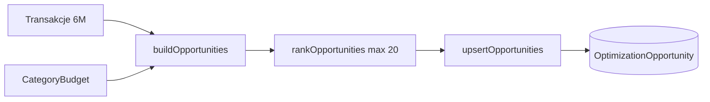

# Optymalizacja budżetu

Moduł identyfikuje konkretne możliwości oszczędności, pozwala ustawić limity kategorii i śledzić wdrożone zmiany. Działa **deterministycznie** (reguły na transakcjach) — AI jest warstwą uzupełniającą (analiza tekstowa, synteza alternatyw).

---

## Dla użytkownika

### Gdzie to znaleźć

- **Optymalizacja** (`/optimize`) — pełna lista, budżety, wdrożone
- **Dashboard** — widget „Top możliwości” + liczba przekroczeń budżetu

Przełącznik **firma / dom / razem** filtruje możliwości i limity tak jak na dashboardzie.

### Typy możliwości

| Typ                     | Znaczenie                                                        | Typowa akcja                         |
| ----------------------- | ---------------------------------------------------------------- | ------------------------------------ |
| **Subskrypcja**         | Cykliczna opłata (NETFLIX, cadence 28–35 dni lub słowa kluczowe) | Anuluj / tańszy plan                 |
| **Powtarzalne**         | Ten sam kontrahent, podobna kwota (≥3× w 90 dni)                 | Przenegocjuj lub złącz               |
| **Wpadka**              | Wydatek > 3× mediana kategorii (6 mies.)                         | Jednorazowa kontrola                 |
| **Skok wydatków**       | Kontrahent w top 15, wzrost m/m > 50% i > 200 PLN                | Sprawdź, czy trend się utrzyma       |
| **Przekroczony budżet** | Suma kategorii > ustawiony limit w tym miesiącu                  | Ogranicz lub podnieś limit świadomie |

Każda karta pokazuje **szacowane oszczędności** (~PLN/mies.) i link do powiązanych transakcji.

### Akcje na karcie

| Przycisk              | Efekt                                                                                                                           |
| --------------------- | ------------------------------------------------------------------------------------------------------------------------------- |
| **Wdrożone**          | Status IMPLEMENTED; po ~30 dniach system może oznaczyć badge „Działa”, jeśli spend na kontrahencie spadł >10%                   |
| **Odrzuć**            | Status DISMISSED; nie pojawi się ponownie przy odświeżeniu (ten sam klucz miesiąca)                                             |
| **Szukaj alternatyw** | Tylko SUBSCRIPTION / RECURRING z kontrahentem — wyszukiwanie Tavily + synteza AI (cache 30 dni, max 10 zapytań/workspace/dzień) |

### Limity budżetu

1. Wybierz kategorię i kwotę limitu (PLN/mies.).
2. Kontekst (firma/dom/razem) musi zgadzać się z przełącznikiem na stronie.
3. Pasek postępu pokazuje wydatki w bieżącym miesiącu; czerwony = przekroczenie.

### Odświeżanie możliwości

Przycisk **Odśwież możliwości** przelicza wykrywanie na podstawie ostatnich 6 miesięcy transakcji. Rekordy ze statusem IMPLEMENTED lub DISMISSED **nie są nadpisywane**.

---

## Dla dewelopera

### Przepływ

### Pliki (`src/lib/optimization/`)

| Moduł                       | Rola                                                    |
| --------------------------- | ------------------------------------------------------- |
| `detect-recurring.ts`       | Grupowanie kontrahent + tolerancja kwoty ±5%            |
| `detect-subscriptions.ts`   | Filtr cadence / słowa kluczowe                          |
| `detect-anomalies.ts`       | 3× mediana kategorii                                    |
| `detect-merchant-spikes.ts` | Wrapper `topMerchants` + progi 50% / 200 PLN            |
| `detect-budget-overruns.ts` | Actual vs `CategoryBudget`                              |
| `build-opportunities.ts`    | Orchestrator                                            |
| `upsert-opportunities.ts`   | Dedupe `dedupeKey` + merge statusów                     |
| `measure-savings-impact.ts` | Follow-up po IMPLEMENTED                                |
| `load-optimization-data.ts` | `refreshWorkspaceOpportunities`, `loadOptimizePageData` |

### Server Actions (`src/server/actions/optimization.ts`)

- `refreshOptimizationOpportunities(context)`
- `updateOpportunityStatus(id, status, followUpNote?)`
- `upsertCategoryBudget(categoryId, accountContext, monthlyLimit)`
- `deleteCategoryBudget(id)`

Research alternatyw: `src/server/actions/research.ts` → `researchOpportunityAlternatives`.

### Progi (stałe w `types.ts`)

| Stała                        | Wartość                              |
| ---------------------------- | ------------------------------------ |
| `ANOMALY_MULTIPLIER`         | 3                                    |
| `SPIKE_MIN_INCREASE_PERCENT` | 50                                   |
| `SPIKE_MIN_AMOUNT_PLN`       | 200                                  |
| `MAX_OPPORTUNITIES`          | 20                                   |
| Okno recurring               | 90 dni, min 3 wystąpienia, ±5% kwoty |

### Spec i plan

- [Spec](superpowers/specs/2026-05-22-budget-optimization.md)
- [Plan implementacji](superpowers/plans/2026-05-22-budget-optimization.md)
- [Research alternatyw](superpowers/specs/2026-05-22-savings-web-research.md)
