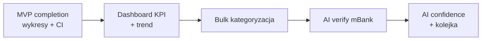

# Roadmap funkcji v1.1 — po domknięciu MVP

**Data:** 2026-05-22  
**Kontekst:** MVP ma import, kategorie mBank 1:1, dashboard (listy), AI batch. Poniżej priorytetyzacja na podstawie feedbacku + speca §6.4.

---

## Priorytet 1 — największa wartość (następny sprint)

### 1. Bogatszy podgląd na dashboardzie

**Problem:** Lista procentów nie daje „od razu widać” trendu i kontekstu.

**Propozycja:**

- Karty KPI: wydatki / wpływy / bilans + **zmiana % vs poprzedni okres** (już mamy dane w `topMerchants`, rozszerzyć na cały okres)
- Wykresy Recharts (kołowy kategorie, słupki merchantów) — w planie `2026-05-22-mvp-completion.md` Task 3
- Mini-wykres trendu 6 miesięcy (sparkline lub bar miesięczny)
- Stały baner: „X transakcji bez kategorii” z linkiem + szacowany % pokrycia
- Blok **„Szybki wgląd”** (AI, cache w DB): 3 bullet points odświeżane na żądanie — rozszerzenie obecnego `aiGenerateInsights`

**Akceptacja:** Para w 5 min widzi trend, top 3 kategorie i 1 rekomendację bez wchodzenia w transakcje.

---

### 2. Grupowa zmiana kategorii

**Problem:** 2000+ transakcji — zmiana pojedynczo w `<select>` jest nie do utrzymania.

**Propozycja UI (`/transactions` lub modal „Masowe”):**

- Filtr: kontrahent zawiera… / kategoria mBank =… / brak kategorii / zakres dat / konto firma|dom
- Podgląd: „Zostanie zaktualizowanych N transakcji”
- Wybór nowej kategorii + **„Zapamiętaj dla tego kontrahenta”** (upsert `MerchantCategoryMemory`)
- Opcja: zastosuj tylko do zaznaczonych ID (checkboxy na stronie)

**Backend:**

- `bulkUpdateCategory({ filters | transactionIds, categoryId, rememberMerchant })`
- Wszystkie zapytania ze `workspaceId`; max 500 tx na operację (batch w pętli)

**Akceptacja:** Zmiana kategorii dla „LIDL” w 40 transakcjach w 2 kliknięcia.

---

### 3. AI — lepsze rozpoznawanie typów wydatków

**Problem:** mBank daje szerokie kubełki („Żywność i chemia domowa”); para chce sensowne kategorie app + tagi zachowania.

**Propozycja (warstwy):**

1. **Reguły + pamięć** (już jest) — zawsze pierwszeństwo
2. **mBank 1:1** (już jest) — kategoria app o nazwie jak mBank
3. **AI batch** (już jest, max 100) — rozszerzyć prompt o:
   - typ: wydatek / przychód / transfer wewnętrzny
   - czy firma czy dom (heurystyka z konta + słowa ZUS/KUP w opisie)
   - confidence 0–1 w JSON (opcjonalnie zapis w polu `metadata` JSON na Transaction — wymaga migracji)

**Bez migracji (szybciej):** AI tylko przypisuje `categoryId`; niska confidence → zostaw `categoryId` null → trafia do kolejki „do ogarnięcia”.

**Akceptacja:** Po AI batch <20% transakcji bez kategorii dla typowych wydatków.

---

### 4. AI weryfikacja przypisań mBank

**Problem:** mBank często ma „Bez kategorii” lub złą kategorię; użytkownik nie wie, czy ufać bankowi czy app.

**Propozycja — strona `/review` lub sekcja na dashboardzie „Do weryfikacji”:**

- Kolejka transakcji gdzie:
  - `mbankCategory` = „Bez kategorii” LUB
  - `category.name !== mbankCategory` (gdy obie ustawione) LUB
  - brak `categoryId` mimo że mBank ma kategorię (sync nie zadziałał)
- AI **nie zmienia od razu** — sugeruje: „mBank: X → proponujemy: Y” z uzasadnieniem 1 zdaniem
- Akcje: Zaakceptuj mBank | Zaakceptuj app | Wybierz inną | Pomiń
- Batch: „Zweryfikuj 50 z AI” (podobny pipeline jak `categorize-batch`)

**Nowe pliki:** `src/lib/ai/verify-mbank-assignments.ts`, `src/server/actions/review.ts`

**Akceptacja:** Użytkownik przechodzi przez 20 pozycji i widzi spójność mBank vs app.

---

## Priorytet 2 — jakość życia

| Funkcja                                | Opis                             |
| -------------------------------------- | -------------------------------- |
| Wyszukiwarka transakcji                | Full-text po opisie/kontrahencie |
| Scalanie kategorii                     | „Połącz X i Y w jedną”           |
| Edycja konta (nie tylko dodawanie)     | Settings                         |
| Powiadomienie email (opcjonalnie)      | „Tydzień bez importu”            |
| Import drag-and-drop + historia batchy | Import page                      |
| Filtr dat na transakcjach              | Od–do w URL                      |

---

## Priorytet 3 — z speca v1.1 / v1.2

- Wpadki i subskrypcje (§6.4 C)
- Budżety / limity per kategoria
- Open Banking mBank (v2)

---

## Proponowana kolejność implementacji

1. Dokończyć `2026-05-22-mvp-completion.md` (Tasks 1–8)
2. **v1.1a:** Bulk update + filtry transakcji
3. **v1.1b:** Review queue mBank + AI verify
4. **v1.1c:** Dashboard trend + cached insight

---

## Zależności techniczne

| Funkcja     | Wymaga                                                       |
| ----------- | ------------------------------------------------------------ |
| Bulk update | Scoped Prisma (`workspaceId`) — wzorzec `delete-scoped.ts`   |
| AI verify   | Klucz API; limit tokenów; audit log opcjonalnie              |
| Trend 6M    | Zapytanie agregujące po miesiącu — czysty SQL/Prisma, bez AI |
| Confidence  | Opcjonalna migracja `Transaction.aiConfidence Float?`        |

---

_Następny plan implementacyjny po MVP completion: `docs/superpowers/plans/2026-05-22-v11-bulk-and-review.md` (do napisania po Task 8)._
