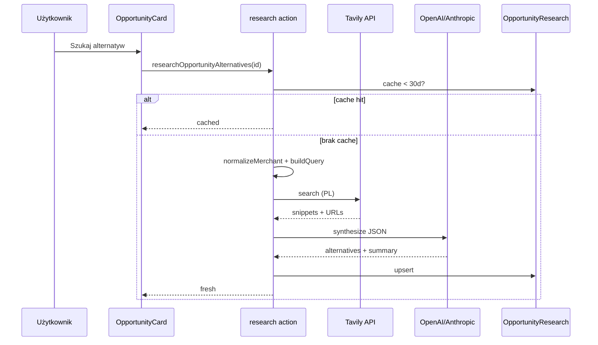

# Spec: Wyszukiwanie alternatyw w internecie

**Data:** 2026-05-22  
**Status:** Zatwierdzony do implementacji  
**Zależności:** Moduł optymalizacji (`/optimize`), opcjonalnie AI (synteza wyników)

---

## Cel

Przy wykrytej możliwości oszczędności (subskrypcja / powtarzalna opłata) użytkownik jednym kliknięciem dostaje **konkretne propozycje tańszych alternatyw** oparte na wynikach wyszukiwania w sieci (nie na halucynacji modelu), z linkami do źródeł i jasnym disclaimerem.

## Zakres MVP

| W scope                                                                     | Poza scope                                               |
| --------------------------------------------------------------------------- | -------------------------------------------------------- |
| Przycisk na karcie możliwości `SUBSCRIPTION` i `RECURRING` z `counterparty` | Automatyczne research przy każdym odświeżeniu możliwości |
| Tavily Search API + synteza AI (istniejący provider)                        | Porównywarki cen w czasie rzeczywistym                   |
| Cache wyniku per `opportunityId` (30 dni)                                   | Research dla `ANOMALY` / `BUDGET_OVERRUN`                |
| Limit 10 zapytań / workspace / dzień                                        | E-mail / push z alertami                                 |

## Przepływ



## Model danych

`OpportunityResearch` (1:1 z `OptimizationOpportunity`):

| Pole              | Typ            | Opis                                           |
| ----------------- | -------------- | ---------------------------------------------- |
| `opportunityId`   | String @unique | FK                                             |
| `workspaceId`     | String         | scoped                                         |
| `searchQuery`     | String         | zapytanie wysłane do Tavily                    |
| `summaryMarkdown` | Text           | krótkie podsumowanie po polsku                 |
| `alternatives`    | Json           | `[{ name, estimatedMonthlyPln?, note }]` max 5 |
| `sources`         | Json           | `[{ title, url }]` max 8                       |
| `researchedAt`    | DateTime       | cache TTL 30 dni                               |

## Reguły biznesowe

1. **Uprawnienia:** tylko zalogowany workspace; `opportunityId` musi należeć do workspace sesji.
2. **Typy:** `SUBSCRIPTION` lub `RECURRING`; wymagane niepuste `counterparty`.
3. **Cache:** jeśli `researchedAt` < 30 dni — zwróć cache bez API (chyba że `forceRefresh=true` w akcji — opcjonalnie pomijamy w MVP).
4. **Limit:** max 10 rekordów z `researchedAt` w bieżącym dniu UTC per `workspaceId` (liczone po create, nie po cache hit).
5. **Normalizacja kontrahenta:** usunięcie szumu mBank (`ZAKUP PRZY UŻYCIU KARTY`, numery kart); mapa znanych merchantów (Netflix, Spotify, …).
6. **Zapytanie Tavily:** `{merchant} tańsza alternatywa cennik Polska`, `country: poland`, `max_results: 5`.
7. **AI:** prompt z snippetami + kwota z opportunity; odpowiedź JSON walidowana Zod; disclaimer w UI zawsze widoczny.
8. **Błędy po polsku:** brak `TAVILY_API_KEY`, brak AI key, limit przekroczony, nieobsługiwany typ.

## UI

- Na `OpportunityCard` (tylko eligible types): przycisk **„Szukaj alternatyw”**.
- Po sukcesie: sekcja z markdown summary, lista alternatyw (nazwa + ~PLN/mies.), lista linków źródeł.
- Stały tekst: _„Informacje z internetu — zweryfikuj ceny i warunki samodzielnie. To nie jest porada finansowa.”_
- Stan ładowania + komunikat błędu inline.

## Zmienne środowiskowe

```env
TAVILY_API_KEY=tvly-...
# istniejące: ANTHROPIC_API_KEY / OPENAI_API_KEY — wymagane do syntezy
```

Funkcja `isResearchAvailable()` = `TAVILY_API_KEY` + `getAiConfig()`.

## Pliki (implementacja)

| Warstwa      | Plik                                                   |
| ------------ | ------------------------------------------------------ |
| Spec         | ten dokument                                           |
| Config       | `src/lib/research/config.ts`                           |
| Normalizacja | `src/lib/research/normalize-merchant.ts`               |
| Zapytanie    | `src/lib/research/build-search-query.ts`               |
| Tavily       | `src/lib/research/search-tavily.ts`                    |
| Synteza      | `src/lib/ai/synthesize-alternatives.ts`                |
| Orchestracja | `src/lib/research/run-opportunity-research.ts`         |
| Akcja        | `src/server/actions/research.ts`                       |
| UI           | `src/components/optimization/ResearchAlternatives.tsx` |
| Testy        | `tests/lib/research/*.test.ts`                         |

## Kryteria akceptacji

- [ ] Subskrypcja Netflix z demo → przycisk → wynik z ≥1 alternatywą i ≥1 linkiem (przy ustawionych kluczach API).
- [ ] Drugie kliknięcie w 30 dni → bez ponownego Tavily (cache).
- [ ] 11. research w tym samym dniu → komunikat o limicie.
- [ ] Brak `TAVILY_API_KEY` → przycisk disabled + tooltip/komunikat.
- [ ] `ANOMALY` → brak przycisku.
- [ ] Testy jednostkowe: normalizacja, build query, parse JSON (mock fetch).

---

_Plan: `docs/superpowers/plans/2026-05-22-savings-web-research.md`_
